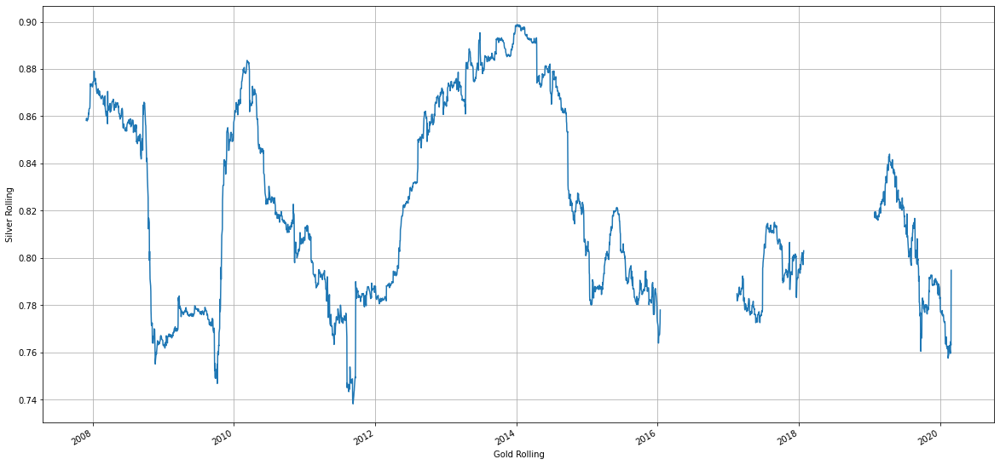

# Gold-analysis-and-prediction

Gold Analysis, Trading Strategy, Backtesting, Prediction and Communication in Python

1. Load data and initial data preview
2. EDA (Exploratory Data Analysis)
3. Visualizing time series data
4. Financial analysis
5. Gold risk and volatility profile
6. Regression analysis - OLS
7. Gold trading strategy
8. Backtesting
9. Predicting gold prices via Facebook Prophet
10. Communication and alert system/s (I recommend to run the Email and Telegram Bot code in PyCharm)

# Jupiter notebook:
https://github.com/trajceskijovan/Gold-analysis-and-prediction/blob/main/Gold_Analysis%2C_Trading_Strategy%2C_Backtesting%2C_Prediction_and_Communication.ipynb

# Colab link: 
https://colab.research.google.com/drive/1ozfC3lx-6Eg65iC5eE6BWP8FFibIOR8W?usp=sharing

# Presentation (deck): 
https://github.com/trajceskijovan/Gold-analysis-and-prediction/blob/main/Gold%20Presentation.pdf

# EDA

# Financial Analysis - Daily % change distribution

# Financial Analysis - Daily Cummulative returns

# Gold Risk / Volatility Profile

# Regression Analysis - OLS (sample, more in code)

# Gold Trading Strategy

# Backtesting

# Predicting Gold prices via Facebook Prophet

# Email and Telegram Bot

